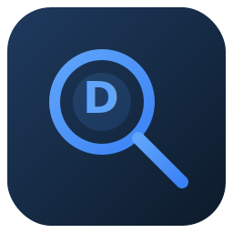
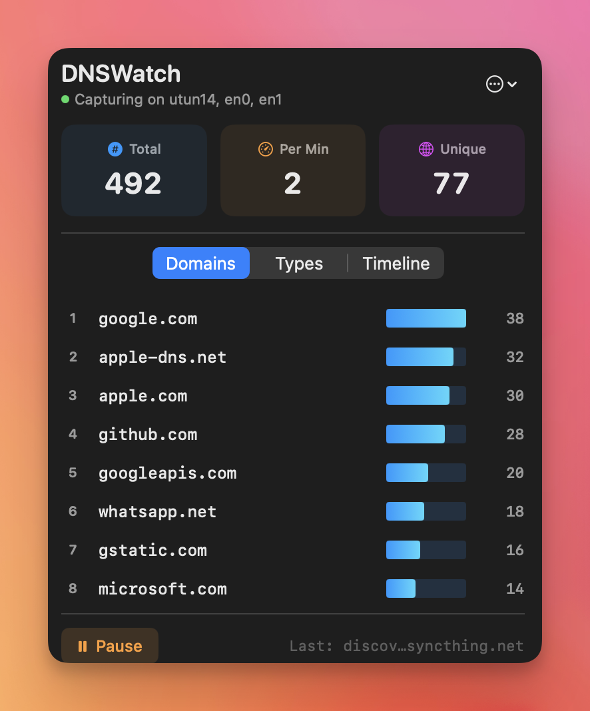

<p align="center">
  
</p>

# DNSWatch

[](https://www.apple.com/macos/)
[](https://swift.org)
[](LICENSE)

A privacy-friendly macOS menu bar app that monitors and visualizes DNS queries in real-time. All data stays on your device.

<p align="center">
  
</p>

## Features

- **Real-time DNS capture** using libpcap
- **Smart interface detection** (supports Tailscale/VPN)
- **Beautiful charts** — top domains, query types, timeline
- **Persistent history** with configurable retention (1–90 days)
- **Privacy-first** — all data stays local

## Installation

### Build from Source

```bash
git clone https://github.com/mr-karan/dnswatch.git
cd dnswatch
make build
```

### Download

Grab the latest from [GitHub Releases](https://github.com/mr-karan/dnswatch/releases).

### macOS Security Warning

Since the app isn't signed with an Apple Developer ID, macOS will show a warning. To open:

1. **Right-click** the app → **Open** → **Open** (in the dialog)

Or remove the quarantine flag:
```bash
xattr -cr /Applications/DNSWatch.app
```

## Setup

DNSWatch needs BPF permissions to capture packets. Recommended (one-time admin prompt):

```bash
# Install the helper to restore permissions at boot
sudo /Applications/DNSWatch.app/Contents/Resources/BPFHelper/install_bpf_helper.sh
```

You can also install the helper from DNSWatch → Settings → Capture Permissions.
If you're running from source, use:

```bash
sudo .build/DNSWatch.app/Contents/Resources/BPFHelper/install_bpf_helper.sh
```

Temporary alternatives:

```bash
# Grant permissions (resets on reboot)
sudo chmod o+rw /dev/bpf*

# Or run with sudo
sudo .build/DNSWatch.app/Contents/MacOS/DNSWatch
```

Then click the network icon in your menu bar.

## How It Works

DNSWatch passively captures DNS traffic using macOS's Berkeley Packet Filter (BPF):

```
Your App (browser, curl, etc.)
       ↓
DNS query to resolver (e.g. 8.8.8.8:53)
       ↓
Network stack sends UDP packet
       ↓
BPF copies packet to /dev/bpf*  ←──  DNSWatch reads here
       ↓
Packet continues to network (unmodified)
```

**Key components:**

1. **BPF devices** (`/dev/bpf*`) — Kernel-level packet capture points exposed by macOS
2. **libpcap** — Opens the interface, sets a filter (`udp port 53`), reads packets in a loop
3. **Interface detection** — Queries `scutil --dns` for active resolver, then `route get` to find which interface (en0, utun3, etc.) carries DNS traffic
4. **DNS parsing** — Strips Ethernet/IP/UDP headers, parses DNS wire format to extract domain and query type (A, AAAA, MX, etc.)

The app sees a *copy* of packets — it doesn't intercept or modify your traffic.

## Development

```bash
./Scripts/compile_and_run.sh    # Dev loop
make build                       # Release build
./Scripts/package_app.sh --sign  # Package DMG
```

See [AGENTS.md](AGENTS.md) for architecture details.

## Privacy

All data stays on your device in `~/Library/Application Support/DNSWatch/`. Nothing is sent anywhere.

## License

MIT
